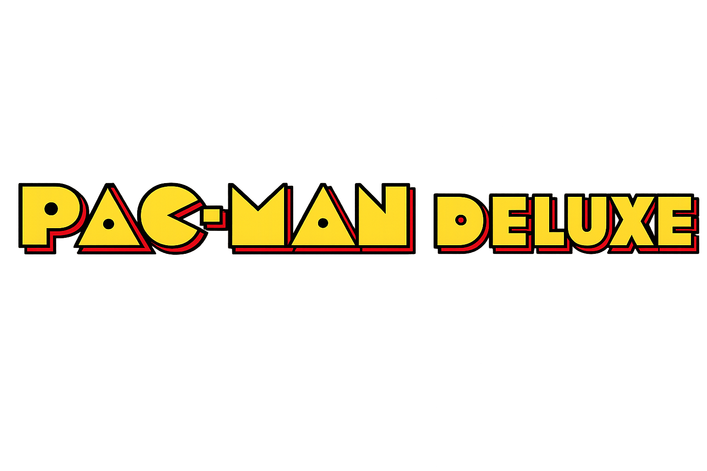

# Pac-Man Deluxe



A 2D Pac-Man-inspired game built with Unity. It expands the classic maze-chase gameplay with local co-op, ghosts using different targeting strategies, increasing level difficulty, and a variety of special items.
## Download the Game

To play without installing Unity, download the latest Windows build from:

[Download Pac-Man Deluxe](你的 GitHub Release 連結)

Extract the ZIP file and run `Pac-Man Deluxe.exe`.

## Features

- Single-player and local two-player modes
- Procedurally generated maze, pellets, ghost house, and portal tunnel
- Multiple ghost AI strategies, including direct pursuit, route prediction, vector-based interception, and random turns
- Level progression with increasing movement speed
- Lives, score, countdown, pause, and result screens
- Background music and sound effects
- Special items that periodically appear throughout the maze

## Controls

| Action | Single Player / Player 1 | Player 2 |
| --- | --- | --- |
| Move | Arrow keys | `W` `A` `S` `D` |
| Use energy bullet / bomb | `Enter` | `Space` |

Other controls:

| Key | Action |
| --- | --- |
| `T` | Pause / resume |
| `R` | Restart the game |
| `Q` | End the game and show the results |

## Special Items

| Item | Effect |
| --- | --- |
| Power Pellet | Temporarily frightens ghosts, allowing players to eat them |
| Energy Pellet | Grants one energy bullet that can defeat ghosts in its path |
| Bomb Pellet | Grants one placeable bomb that creates a cross-shaped explosion |
| Phantom Pellet | Creates a phantom decoy that temporarily distracts the ghosts |
| Lightning Pellet | Creates a lightning link that attacks ghosts; it only spawns randomly in two-player mode |

Players can carry either an energy bullet or a bomb, but not both. The item is consumed after use.

## Running the Project

### Requirements

- Unity `6000.3.15f1`
- Universal Render Pipeline `17.3.0`
- Unity Editor on Windows, macOS, or Linux

### Open and Play

1. Add this project folder through Unity Hub.
2. Open the project with Unity `6000.3.15f1`.
3. Open `Assets/Scenes/SampleScene.unity`.
4. Press the Play button at the top of the Unity Editor.
5. Select single-player or two-player mode from the main menu.

When the project is opened for the first time, Unity will automatically install the packages listed in `Packages/manifest.json`.

## Building the Game

1. In Unity, open `File > Build Profiles`.
2. Select the target platform and switch to it.
3. Make sure `Assets/Scenes/SampleScene.unity` is included in the scene list.
4. Select `Build` or `Build And Run`.

## Project Structure

```text
Assets/
|-- Editor/       # Scene-building tools
|-- Resources/    # Menu images, item sprites, and audio
|-- Scenes/       # Main game scene
|-- Scripts/      # Game flow, player, ghost, maze, and item logic
|-- Sprites/      # Runtime sprite resources
|-- UI/           # Main menu, HUD, countdown, and result screens
`-- Settings/     # URP and 2D Renderer settings
```

Main scripts:

- `GameManager.cs`: Game modes, levels, lives, scoring, and special effects
- `MazeGenerator.cs`: Maze, walls, pellets, ghost house, and portal tunnel
- `PlayerController.cs`: Player movement, collisions, respawning, and item use
- `GhostController.cs`: Ghost states, pathfinding, and targeting strategies
- `BasicSceneBuilder.cs`: Rebuilds the basic scene from the Unity menu

To rebuild the basic scene, exit Play Mode and select:

```text
Tools > Pac-Man Deluxe > Build Basic Scene
```

## Development Shortcuts

The following shortcuts are intended for testing:

| Key | Action |
| --- | --- |
| `N` | Skip to the next level |
| `K` or `F9` | Toggle invincibility |

## Disclaimer

This project is an unofficial fan project created for educational purposes and is not affiliated with Bandai Namco Entertainment. The Pac-Man name and related characters belong to their respective rights holders. Please verify the licensing status of all images, audio, and other assets before publishing or reusing them.
